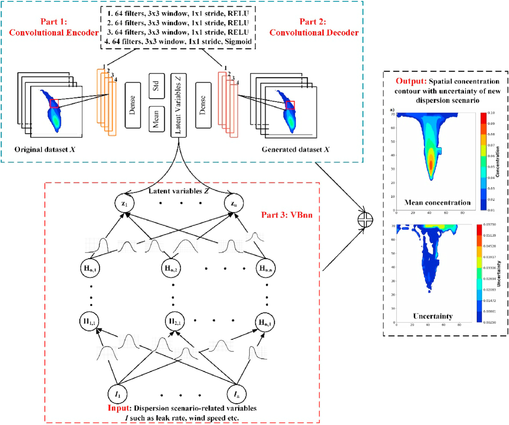
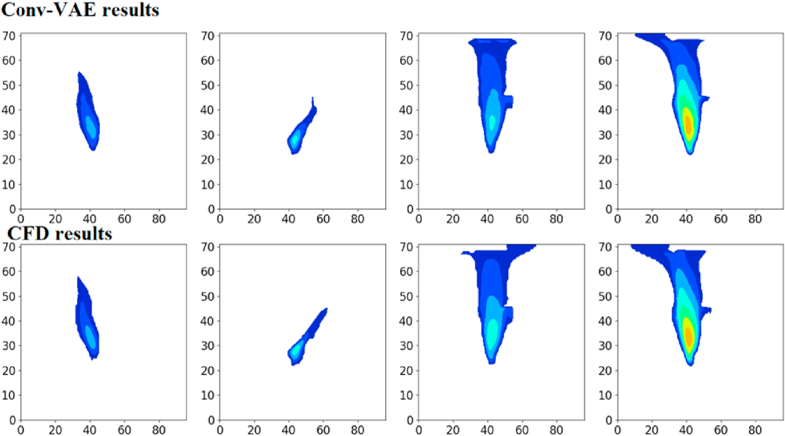

Conv-VAE-VBnn
=============
Paper is available on https://doi.org/10.1016/j.energy.2020.119572
### Intorduction
**Conv-VAE-VBnn** is a hybird deep-learning approach for rapidly modeling gas dispersion, which is essentially a probabilistic Convolutional-Variational Autoencoder-Variational Bayesian neural network. By this approach, one can realize model the released gas spatial concentration and achieve the uncertainty of this predicted spatial concentration, which can replace the  Computational Fluid Dynamic (CFD) to support real-time emergency response planning. 

### Architecture

	

</a>.

### Result

	

</a>.

### Approach comparison 
<table>
<tr>
    <th colspan="1">Approach</th>
    <th colspan="1">MSE</th>
    <th colspan="1">R2</th>
    <th colspan="1">Inference time</th>
      
</tr>
<tr>
    <th>Our model</th>
    <td>7.03-E06</td>
    <td>0.9410</td>
    <td>13 ms</td>
</tr>
<tr>
    <th>Conv-VAE-NN model</th>
    <td>8.98-E06</td>
    <td>0.9201</td>
    <td>6 ms</td>
</tr>

<tr>
    <th>VAE-BNN model</th>
    <td>4.78-E05</td>
    <td>0.6360</td>
    <td>10 ms</td>
</tr>
<tr>
    <th>CFD model</th>
    <td>N/A</td>
    <td>N/A</td>
    <td>> 12h</td>
</tr>
</table>
